# **Nmap (Network Mapper)**  

### **Submitted By**  
- **Qusai Sakerwala** - 16010122231  
- **Himanshu Garg** - 16010122238  
- **Ayush Nayak** - 16010122243  
- **Mourvi Joshi** - 16010122279  

### **Guide**  
- **Zaheed Shaikh**  

### **Department of Computer Engineering**  

---

## **Contents**  

| Section                       | Page |
|-------------------------------|------|
| **Introduction**              | iii  |
| **Features/Characteristics**  | iv   |
| **Methodology**               | v    |
| **Results**                   | v    |
| **Conclusion**                | xiv  |
| **References**                | xiv  |  

---
***Introduction*** 

Nmap (Network Mapper) stands as a quintessential tool in the arsenal of network administrators and cybersecurity professionals due to its extensive capabilities in network exploration and security auditing. Originally created by Gordon Lyon (Fyodor) in 1997, Nmap was designed to provide a comprehensive and efficient means of scanning large and complex networks to gather critical information. Today, it has evolved into a widely utilized open-source utility that helps individuals and organizations enhance their security posture by detecting vulnerabilities, unauthorized devices, and potential points of attack.

At its core, Nmap is used to discover devices connected to a network, map out the network topology, and uncover key details about the devices, such as their IP addresses, open ports, running services, and even operating system types. These capabilities allow network administrators to maintain control over their infrastructure, while also giving security experts a tool to identify weak spots that malicious actors could exploit. Nmap’s utility is not confined to basic network discovery; it is also extensively used for security assessments, vulnerability scanning, and penetration testing.

What sets Nmap apart is its flexibility. Whether performing simple ping sweeps or advanced penetration testing, Nmap can adapt to various scanning needs through its diverse set of features, such as OS fingerprinting, service version detection, and customizable scriptable functionality. This adaptability has made Nmap a go-to tool for security professionals engaged in ethical hacking and cybersecurity assessments, as it offers a deep level of insight into a system’s security posture without requiring proprietary or expensive solutions.

The ongoing development of Nmap by an active open-source community ensures that it remains a cutting-edge tool, constantly evolving to address new security challenges. With Nmap, cybersecurity experts can proactively uncover network flaws, monitor for new vulnerabilities, and conduct thorough assessments, making it an indispensable resource in the world of network security and penetration testing. Its widespread use across industries underscores the essential role it plays in safeguarding digital infrastructures against emerging threats and ensuring network resilience.

***Features/Characteristics***
---
1. **Host Discovery**: Nmap efficiently identifies active devices on a network by sending ICMP (ping) requests or using other methods to determine which systems are live. This is a fundamental first step in network analysis, especially when managing large networks or performing penetration tests.
1. **Port Scanning**: One of the core functions of Nmap is its ability to detect open ports on a device. These ports are crucial points of communication, and discovering which ones are open helps security professionals assess the potential entry points for attackers. Nmap supports various scanning techniques to perform thorough port scans, including TCP, UDP, and SCTP scanning.
1. **Service and Version Detection**: Nmap goes beyond simple port scanning by identifying the specific services running on open ports and their versions. This is particularly useful for identifying outdated or vulnerable software, enabling security experts to address potential risks by updating or patching the services accordingly.
1. **OS Detection**: Using TCP/IP fingerprinting, Nmap can determine the operating system running on a target device. This feature allows security professionals to tailor their scans based on the operating system, as different OSes have varying vulnerabilities. OS detection provides valuable insights into the system's architecture and its susceptibility to specific attacks.
1. **Security Auditing**: Nmap is widely used for security auditing purposes, where it helps to identify vulnerabilities within a network, devices, and applications. This is crucial for spotting misconfigurations, identifying unauthorized access points, or testing the strength of firewall rules to ensure they are properly configured to protect the network from malicious threats.
1. **Stealth Scanning**: Nmap offers several scanning methods designed to perform stealth scans, such as SYN scanning (also known as half-open scanning) or FIN scanning. These techniques are employed to avoid detection by firewalls and intrusion detection systems (IDS), allowing penetration testers to conduct more discreet assessments.
1. **Nmap Scripting Engine (NSE)**: One of Nmap’s most powerful features, the Nmap Scripting Engine, allows users to write custom scripts or utilize a collection of pre-built scripts for a variety of purposes. These include vulnerability detection, service discovery, network monitoring, and even exploit testing. NSE enhances Nmap's capabilities, enabling automation of tasks that would otherwise be time-consuming.
1. **Zenmap (GUI for Nmap)**: Zenmap is a graphical user interface (GUI) for Nmap, providing an intuitive and user-friendly interface that makes network scanning more accessible. Zenmap allows users to visually map out their network, generate reports, and save scan results in a format that’s easy to understand and analyze, making it a helpful tool for both beginners and advanced users.

***Methodology and Results*** 
---
To perform network scanning using Nmap, we utilized various commands to analyze different aspects of network security. Below are the methodologies followed in our assignment:

1. **Checking Network Configuration:**
   1. Command: **ifconfig**
   1. Purpose: Displays network interface details including IP address and subnet mask.

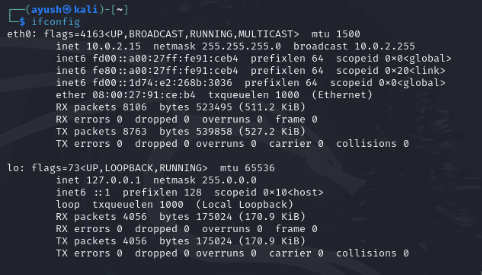

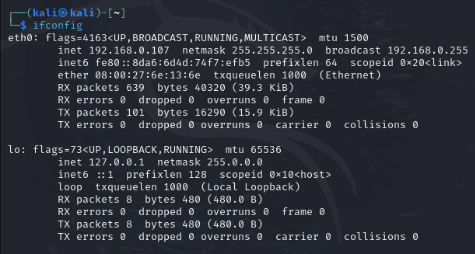

1. **IP Address Calculation:**
   1. Command: **ipcalc <IP Address>**
   1. Purpose: Calculates and displays network-related information such as netmask,
   1. broadcast, and host range.

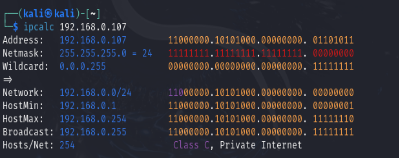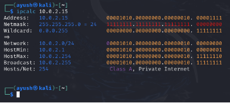

1. **Scanning Live Hosts on a Network:**
   1. Command: **nmap -sP <Network IP>**
   1. Purpose: Identifies active devices on a subnet.

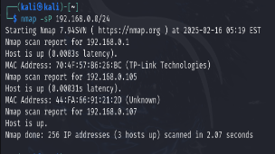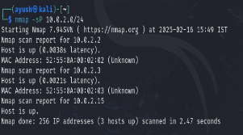

1. **Scanning a Range of IP Addresses:**
   1. Command: **nmap <start-IP>-<end-IP>**
   1. Purpose: Scans a specified range of IP addresses

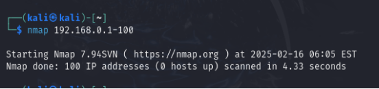.

1. **Scanning an Entire Subnet:**
   1. Command: **nmap <subnet>**
   1. Purpose: Scans all devices within a subnet.

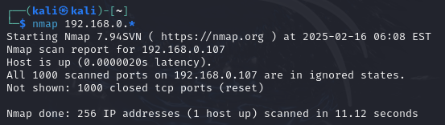

1. **Scanning the Top N Most Common Ports:**
   1. Command: **nmap --top-ports 10 scanme.nmap.org**
   1. Purpose: Scans the top 10 most commonly used ports.

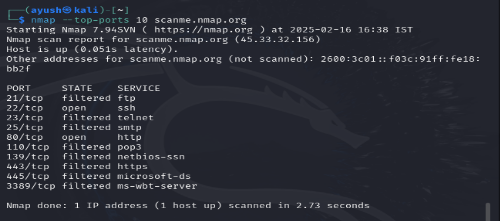

1. **Scanning Specific Ports Using Different Scan Methods:**
   1. Command: sudo nmap -**sT -p 80,443 <Network IP>** (TCP Connect Scan)
   1. Command: sudo nmap **-sS -p 80,443 <Network IP>** (Stealth Scan)
   1. Purpose: Checks whether specific ports (e.g., 80, 443) are open.

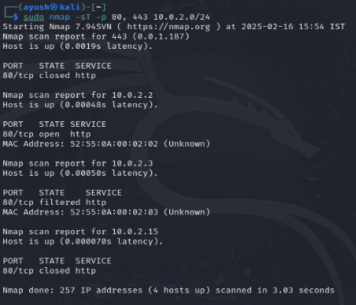

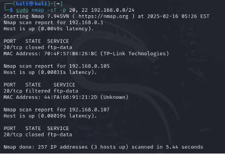

1. **Aggressive Scan for Detailed Information:**
   1. Command: nmap **-A <IP Address>**
   1. Purpose: Performs a comprehensive scan, including OS detection, version detection, and script scanning.

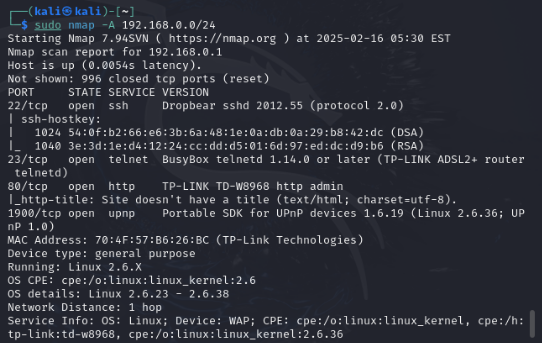

1. **Saving Scan Output:**
   1. Command: nmap **-oA output scanme.nmap.org**
   1. Purpose: Saves scan results in different formats for further analysis.

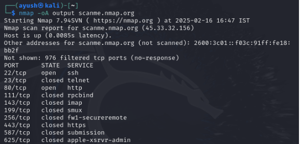

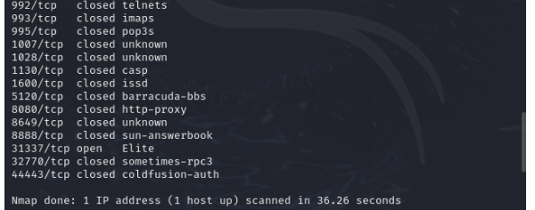

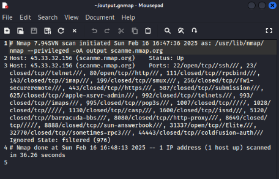

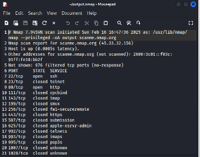

1. **Scanning Multiple Targets from a File:**
- Command: **nmap -iL input\_ips.txt**
- Purpose: Reads target IPs from a file and performs scanning.

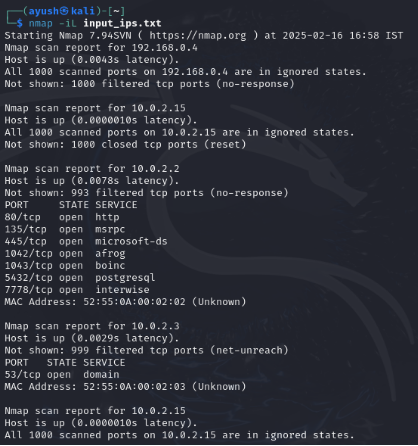

11. **Using Zenmap (GUI for Nmap):**
- Purpose: Provides a user-friendly interface for performing and visualizing scans.

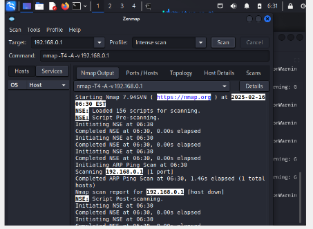

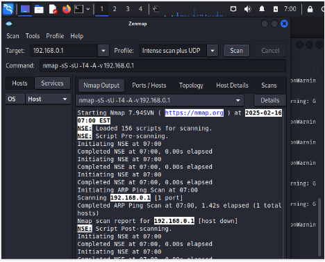

***Conclusion***
---
Nmap is a powerful and essential tool for network security analysis, penetration testing, and cybersecurity research. Its ability to perform host discovery, port scanning, service identification, and OS detection makes it invaluable for security professionals. Our study demonstrated the efficiency of Nmap in identifying vulnerabilities and assessing network configurations. The use of advanced scanning techniques, including stealth and aggressive scans, further emphasized its versatility in cybersecurity assessments. With its continuous updates and scripting capabilities, Nmap remains a crucial tool in modern network security.

**References**
---
1. [FreeCodeCamp - What is Nmap and How to Use It](https://www.freecodecamp.org/news/what-is-nmap-and-how-to-use-it-a-tutorial-for-the-greatest-scanning-tool-of-all-time/)
1. [Official Nmap Website](https://nmap.org/)

**Department of Computer Engineering  Semester VI  2024-25**	Page 

